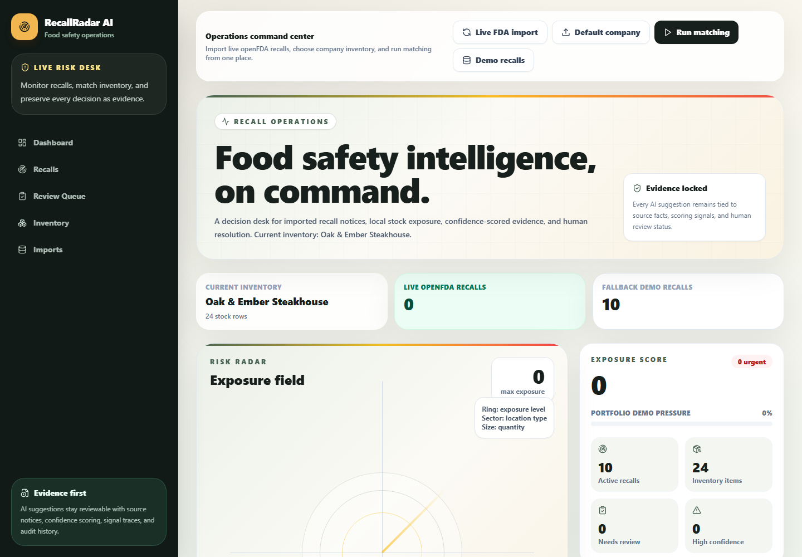
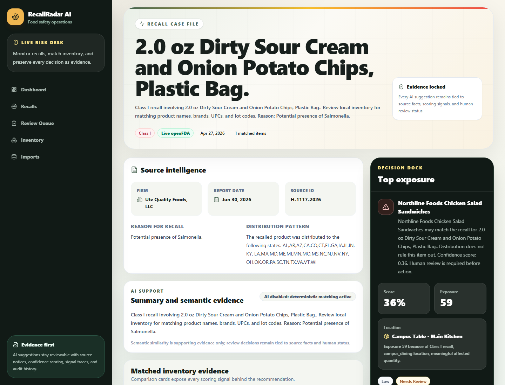
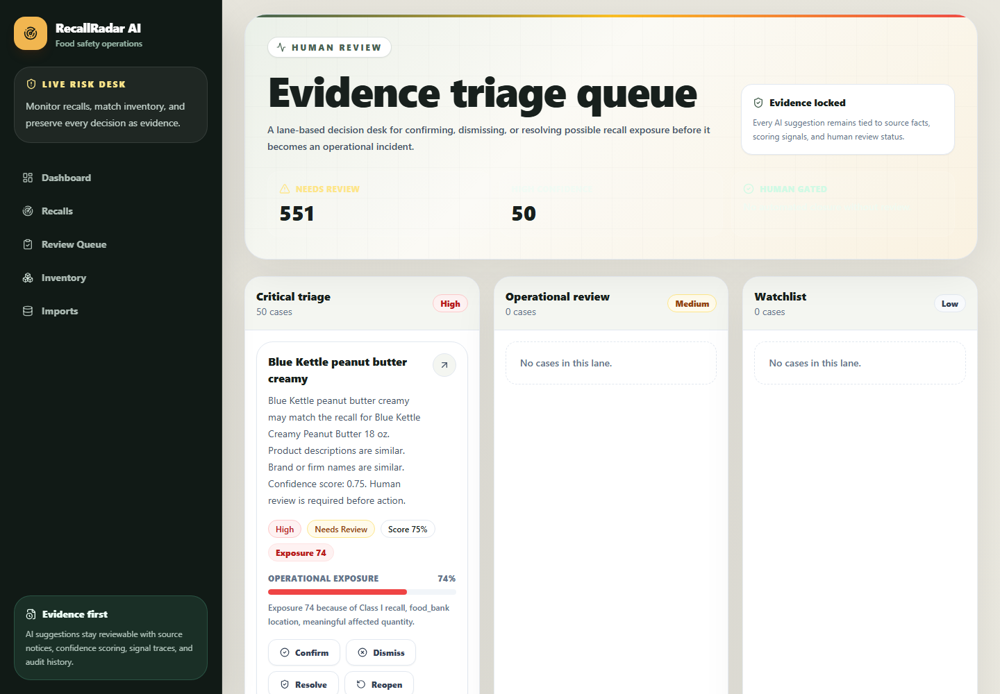

# RecallRadar AI

RecallRadar AI is a food-safety operations app that helps a team answer a simple question quickly: "Do we have recalled product in our inventory right now?"

It pulls live food recall data from openFDA, provides a deterministic Portfolio Demo mode, lets a user load fictional company inventory, runs explainable recall-to-inventory matching, and gives staff a clean review workflow for confirming, dismissing, or resolving possible exposure.

Live deployment:

- Frontend: `https://recallradar-ai.vercel.app`
- Backend API: `https://recallradar-api.onrender.com`

> **Safety boundary:** This is a no-login, single-workspace portfolio MVP. Use the hosted instance with synthetic demo data only. Do not upload real customer inventory or rely on it for regulatory action until authentication, tenant isolation, access control, retention, and production monitoring are added.

## What It Does

Most public recall notices are messy to work with in real life. Product names vary, UPCs are incomplete, lot details are inconsistent, and smaller organizations often manage stock with spreadsheets or lightweight internal tools instead of enterprise systems.

RecallRadar AI turns that into a practical workflow:

1. Pull the latest FDA recall data.
2. Load a company inventory profile.
3. Match recalled products against local stock.
4. Show why each match was flagged.
5. Let a human reviewer decide what is real and what is noise.

## Why This Feels Real

This is not just a static dashboard with fake charts.

- Recalls come from the live openFDA food enforcement API.
- The app auto-refreshes live recall data on launch when the last successful refresh is stale.
- Matching is explainable and reviewable instead of being a black-box score.
- Inventory stays intentionally fictional so the demo is repeatable and safe to show.
- The deployed app uses a real hosted frontend, backend, and Postgres database.

## Data modes and product flow

For the user-facing experience:

- Live FDA mode uses public openFDA data and labels weak matches as possible candidates.
- Portfolio Demo mode uses bundled synthetic recalls and inventory with repeatable labeled results.
- Inventory comes from fictional company profiles or CSV upload.
- CSV upload validates and stores rows first; matching is an explicit next step.
- Matching uses a release threshold of `0.50` to avoid surfacing weak lexical coincidences.

Live FDA flow:

1. Open the app.
2. Let live FDA recalls load automatically.
3. Choose a company inventory.
4. Click `Run matching`.
5. Review the dashboard, recall queue, and evidence.

Portfolio Demo flow:

1. Open the app.
2. Choose `Portfolio demo` in the command bar.
3. Show the deterministic five high-confidence and three medium-confidence examples.
4. Open the review queue and inspect the evidence trail.

The modes remain visibly separate. Portfolio Demo is not live FDA data.

## Main Features

- Live openFDA food recall import.
- Auto-refresh status with throttling.
- Fictional demo company inventory profiles.
- Inventory CSV upload support.
- Explainable recall-to-inventory matching.
- Deterministic Portfolio Demo mode with labeled evaluation fixtures.
- Repeatable precision/recall evaluation harness.
- Match confidence and review states.
- Dashboard with exposure and workload views.
- Recall case file and review queue workflow.
- Production-minded deployment on Vercel + Render + Postgres.
- Free-tier Render warm-up workflow with a read-only scheduled health check.

## Deployed Demo Walkthrough

Use this flow when showing the project:

1. Open `https://recallradar-ai.vercel.app`.
2. Choose `Portfolio demo` for the deterministic walkthrough.
3. Show the five high-confidence and three medium-confidence examples.
4. Explain that match confidence and operational exposure are separate signals.
5. Open the recalls worklist and pick a case.
6. Open the review queue and confirm, dismiss, resolve, or reopen a match.
7. Optionally switch back to Live FDA mode and explain why real source data is noisier.

Good companies to use in a demo:

- `Campus Table Dining`
- `MetroMart Grocery`
- `Oak & Ember Steakhouse`

## Screenshots

### Dashboard



### Recall case file



### Review queue



## Production Readiness Pass

Completed before deployment:

- Deployed frontend to Vercel.
- Deployed backend to Render.
- Moved production persistence to Postgres.
- Added import status tracking in the database.
- Added `GET /recalls/imports/status`.
- Throttled auto-refresh to once every 30 minutes unless manually forced.
- Added a free GitHub Actions health check every 10 minutes to reduce Render Free cold starts.
- Moved backend CORS to environment configuration.
- Kept demo recall seeding disabled by default.
- Added best-effort in-memory rate limits and bounded CSV uploads for the public no-login demo.
- Added safe production error responses, security headers, and disabled API docs in production.
- Added a read-only smoke script; rerun it immediately before claiming hosted availability.

The local release candidate was verified with backend tests, Ruff, frontend lint/build, Playwright browser coverage, and the deterministic matching evaluator. Hosted availability remains an operational check, not a permanent claim. Run `python scripts/smoke.py --api <api-url> --frontend <frontend-url>` before a public demonstration.

## Stack

- Frontend: Next.js, TypeScript, Tailwind CSS
- Backend: FastAPI, Python
- Database: PostgreSQL
- ORM: SQLAlchemy
- Migrations: Alembic
- Testing: pytest, Playwright
- Hosting: Vercel + Render

## Local Development

Start PostgreSQL:

```bash
docker compose up -d
```

Install backend dependencies:

```bash
cd backend
python -m venv .venv
.venv/Scripts/python -m pip install -r requirements.txt
```

Run migrations:

```bash
cd backend
.venv/Scripts/alembic upgrade head
```

Start backend:

```bash
cd backend
.venv/Scripts/python -m uvicorn app.main:app --reload
```

Install frontend dependencies:

```bash
cd frontend
npm install
```

Start frontend:

```bash
cd frontend
npm run dev
```

Open:

```text
http://localhost:3000
```

## Environment

Backend:

```text
APP_ENV=production
DATABASE_URL=<database url>
CORS_ALLOWED_ORIGINS=<comma separated frontend origins>
OPENFDA_REFRESH_MINUTES=30
OPENFDA_API_KEY=<optional>
ENABLE_DEMO_RECALL_SEED=false
MAX_UPLOAD_MB=2
MAX_CSV_ROWS=5000
RATE_LIMIT_WINDOW_SECONDS=60
RATE_LIMIT_READ_PER_WINDOW=120
RATE_LIMIT_ACTION_PER_WINDOW=12
RATE_LIMIT_UPLOAD_PER_WINDOW=5
```

Frontend:

```text
NEXT_PUBLIC_API_BASE_URL=<backend base url>
```

## Testing

Backend:

```bash
cd backend
.venv/Scripts/python -m pytest
.venv/Scripts/ruff check app tests scripts
.venv/Scripts/python -m scripts.evaluate_matching
```

Frontend build:

```bash
cd frontend
npm run lint
NEXT_PUBLIC_API_BASE_URL=http://127.0.0.1:8100 npm run build
```

Frontend e2e:

```bash
cd frontend
npm run test:e2e
```

See [the portfolio release guide](docs/PORTFOLIO_RELEASE.md) and [matching evaluation](docs/MATCHING_EVALUATION.md) for the release gate, demo script, measured metrics, and production limitations.

## Project Structure

```text
frontend/
backend/
docs/
docker-compose.yml
render.yaml
README.md
```

## Documentation

- [Deployment notes](docs/DEPLOYMENT.md)
- [Architecture](docs/ARCHITECTURE.md)
- [API design](docs/API_DESIGN.md)
- [Data model](docs/DATA_MODEL.md)
- [AI matching spec](docs/AI_MATCHING_SPEC.md)
- [UX spec](docs/UX_SPEC.md)
- [Test plan](docs/TEST_PLAN.md)

## Resume-Ready Summary

Built and deployed a food-safety intelligence platform that ingests live FDA recall data, matches recalls against inventory, explains evidence behind potential exposure, and supports human-in-the-loop review with a production-style full-stack architecture.
